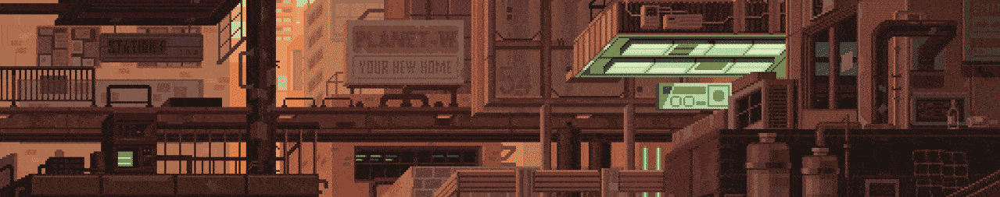

    
	
<h3 align="center">Hello There, the name is Aina Rajaonah. Here some of my skills:</h3>

  

       

    

      
    

    

 
 

    

    

  <a href="https://github.com/aandriamgit">
  
<a/>
  <a href="https://github.com/aandriamgit">
    
<a/>

 

 
 

    

    

 
 
 
 
 
 
 
 
 

 

