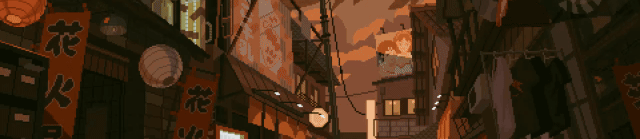

<p align="center">
<a href="https://github.com/aandriamgit"></a>
	
<h3 align="center">Hello There, the name is Aina Rajaonah. Here some of my skills:</h3>
<div align="center">
<a href="https://www.cprogramming.com/" target="_blank">  </a>
<a href="https://cppreference.com/" target="_blank">  </a>
<a href="https://www.vim.org/" target="_blank">  </a>
<a href="https://neovim.io/" target="_blank">  </a>
<a href="https://godotengine.org//" target="_blank">  </a>
<a href="https://git-scm.com/" target="_blank">  </a>
       
</div>
</p>

<p align="center">
    <a href="https://github.com/aandriamgit">
        
    </a>
    <div align="center">
        <a href="https://dicf.unepgrid.ch/madagascar" target="_blank">  </a>
        <a href="https://www.42network.org/campus/42-antananarivo/#:~:text=The%20establishment%20of%2042%20in,digital%20sector%2C%20promoting%20social%20inclusion." target="_blank">  </a>
        <a href="https://profile.intra.42.fr/users/aandriam" target="_blank">  </a>
        <a href="#" target="_blank">  </a>
    </div>
<p/>

<br/>
<p align="center">
<a href="https://github.com/aandriamgit"></a>
</p>

[](#)

    
<div align="center">
  <a href="https://github.com/aandriamgit?tab=repositories">
  
<a/>
  <a href="https://github.com/aandriamgit?tab=repositories">
    
<a/>

</div>
<br/>
<div>
<br/>
<br/>
<div/>
<p align="center">
<a href="https://github.com/aandriamgit"></a>
</p>
<div align="center">
<a href="https://github.com/aandriamgit/kitty">
  
</a>
<a href="https://github.com/aandriamgit/command_sh">
  
</a>
</div>

<br/>
<br/>
<br/>
<div align="center">
	 <a href="https://github.com/aandriamgit/godot_test_gdextension">
  
</a>
<a href="https://github.com/aandriamgit/nvim">
  
</a>
</div>
</div>

---

## 🛠️ Configuration & Setup Scripts

### Brave Browser Desktop Integration
This repository includes a complete setup for integrating Brave browser as a desktop application.

📁 **Location**: `brave-setup/`

**Features:**
- Proper `.desktop` file with MIME types and actions
- Automated installation script
- Fixes AppImage integration dialog issues
- Creates desktop shortcuts

**Quick Start:**
```bash
cd brave-setup
./install-brave-desktop.sh
```

📖 See [brave-setup/README.md](brave-setup/README.md) for detailed instructions.
